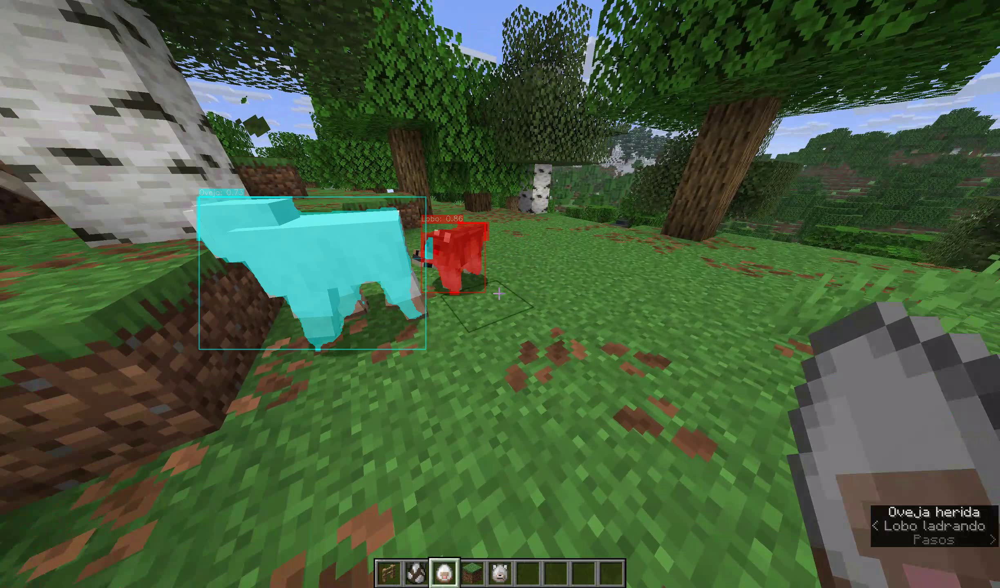

# Detección y Segmentación de Animales de Minecraft con YOLOv8

Proyecto desarrollado para el Taller de Introducción a Visión por Computadora. Consiste en un modelo de segmentación de instancias entrenado con **YOLOv8n-seg** para detectar y segmentar animales del videojuego Minecraft (Cerdo, Gallina, Lobo, Oveja y Vaca) a partir de capturas del juego.

El proyecto incluye:
- Entrenamiento del modelo sobre un dataset propio anotado en Roboflow (150 épocas, imgsz 640).
- Evaluación de métricas (Precision, Recall, mAP50, mAP50-95) sobre el set de validación.
- Un **pipeline de inferencia implementado íntegramente con OpenCV** (sin usar `r.plot()` de Ultralytics) que dibuja manualmente cajas delimitadoras, máscaras de segmentación, etiquetas y confianza, tanto sobre imágenes como sobre video.
- Evaluación cualitativa del modelo sobre un video nuevo de gameplay (no perteneciente al dataset de entrenamiento), con análisis crítico de aciertos, fallos y limitaciones encontradas.

## Estructura del repositorio

```
├── Animales_minecraft.ipynb   # Notebook con entrenamiento, evaluación e inferencia
├── resultado.mp4              # Video de prueba procesado con el pipeline de inferencia
├── ejemplo_inferencia.png     # Imagen de ejemplo con la inferencia realizada
└── README.md
```
## Librerías necesarias

Para ejecutar el notebook se requieren las siguientes librerías (instalables vía `pip`):

- `ultralytics` — carga, entrenamiento e inferencia del modelo YOLOv8.
- `roboflow` — descarga del dataset anotado.
- `opencv-python` (`cv2`) — dibujo manual de cajas, máscaras y etiquetas, y lectura/escritura de video.
- `numpy` — manejo de arreglos y coordenadas de las máscaras.
- `matplotlib` — visualización de imágenes y gráficos de métricas dentro del notebook.
- `torch` — backend de inferencia/entrenamiento (se instala como dependencia de `ultralytics`).

Instalación rápida:

```bash
pip install ultralytics roboflow opencv-python numpy matplotlib torch
```

> El notebook está preparado para ejecutarse en Google Colab con GPU (T4), donde la mayoría de estas librerías ya vienen preinstaladas.

## Ejemplo de inferencia

Detección y segmentación simultánea de una Oveja y un Lobo en una escena con oclusión parcial entre ambos animales:



## Resultados del modelo (validación)

| Clase | Precision | Recall | mAP50 | mAP50-95 |
|---|---|---|---|---|
| Cerdo | 0.817 | 0.872 | 0.842 | 0.661 |
| Gallina | 0.963 | 0.957 | 0.967 | 0.817 |
| Lobo | 0.883 | 0.785 | 0.869 | 0.717 |
| Oveja | 0.842 | 0.689 | 0.751 | 0.556 |
| Vaca | 0.940 | 0.729 | 0.829 | 0.648 |
| **Promedio** | **0.889** | **0.806** | **0.852** | **0.680** |

## Limitaciones observadas

Durante la evaluación con datos nuevos (video de gameplay), se identificaron limitaciones relacionadas con la dependencia del color/textura por sobre la forma del objeto: el modelo no detecta ovejas de lana negra, confunde el destello de daño al morir una oveja con la clase "Cerdo", y clasifica erróneamente bloques de lana sueltos como "Oveja". El detalle completo del análisis crítico se encuentra en el notebook, en la sección posterior al pipeline de inferencia.
